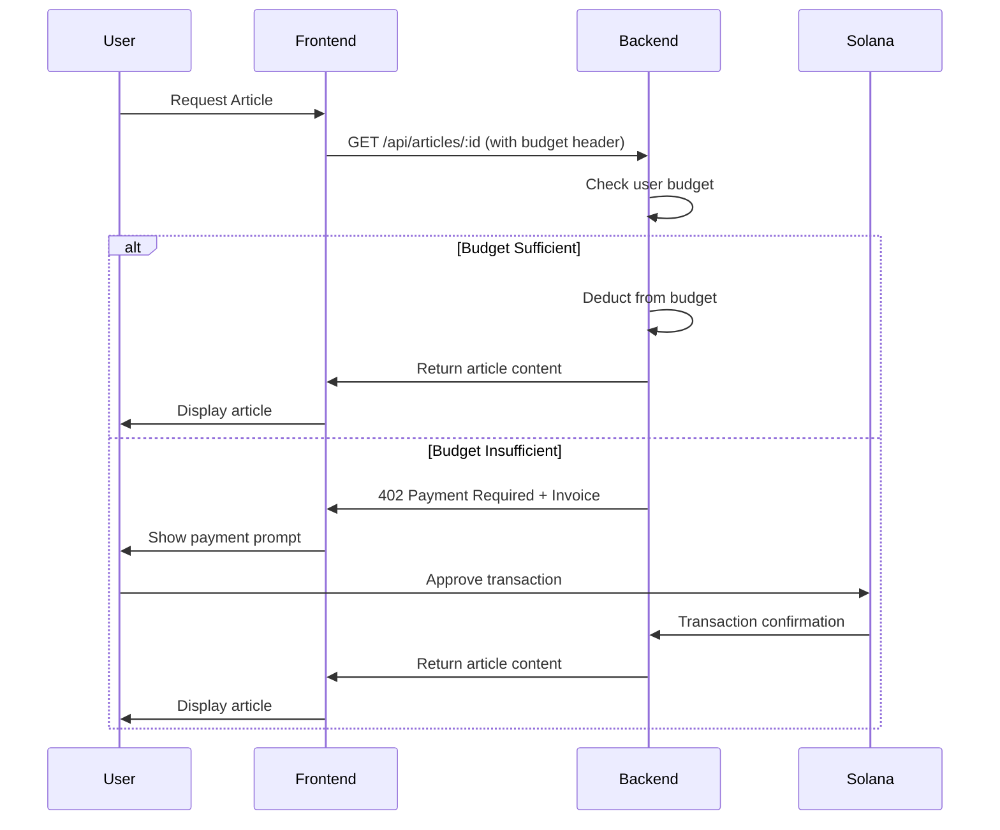

# x402 Articles: Blockchain-Powered Content Monetization

A modern micropayment system built on the Solana blockchain that enables content creators to monetize their articles through blockchain-based payments using the x402 HTTP payment protocol. Readers and AI agents can now pay per article (from $0.01) with minimal fees, so creators keep nearly all revenue.

## 🌟 Overview

**X402 Articles** is a comprehensive content management system (CMS) that combines traditional web technologies with cutting-edge blockchain payments. It allows authors to publish premium content behind a paywall while providing readers with seamless access through Solana SPL token payments.

### Key Features

- **🔗 Blockchain Payments**: Built on Solana blockchain with SPL token support (USDC)
- **💰 Micropayments**: Pay-per-article model with minimal transaction costs
- **📚 Content Management**: Markdown-based article system with rich metadata
- **🤖 AI Assistant**: Integrated agent for content discovery and assistance
- **💳 Budget System**: Pre-paid budget for seamless article access
- **🔒 Security First**: Input validation, rate limiting, and secure transaction handling
- **📱 Responsive Design**: Mobile-first UI built with React and Tailwind CSS

## 🏗️ Architecture

The project consists of two main components:

### Backend (Node.js/TypeScript)
- **Framework**: Express.js with TypeScript
- **Blockchain**: Solana Web3.js integration
- **Database**: SQLite with optional Vercel KV support
- **Content**: Markdown processing with gray-matter
- **Security**: Comprehensive validation and rate limiting

### Frontend (React)
- **Framework**: React 18.3.1 with modern hooks
- **Build Tool**: Vite for fast development
- **Styling**: Tailwind CSS
- **Blockchain**: Solana wallet adapters
- **State Management**: React Context API

## 🚀 Quick Start

### Prerequisites
- Node.js 18+
- npm or yarn
- Solana wallet (Phantom, Solflare, etc.)

### Installation

1. **Clone the repository**
   ```bash
   git clone <repository-url>
   cd x402-new
   ```

2. **Backend Setup**
   ```bash
   cd backend
   npm install
   ```

3. **Frontend Setup**
   ```bash
   cd frontend
   npm install
   ```

4. **Environment Configuration**

   Create a `.env` file in the backend directory:
   ```env
   # Solana Configuration
   SOLANA_NETWORK=devnet
   MY_WALLET_ADDRESS=<your-solana-wallet-address>
   SPL_TOKEN_MINT=EPjFWdd5AufqSSqeM2qN1xzybapC8G4wEGGkZwyTDt1v  # USDC devnet

   # API Configuration
   PORT=3001
   CORS_ORIGINS=http://localhost:3000,http://localhost:5173

   # Content Directory
   ARTICLES_PATH=./backend/articles

   # Optional: Vercel KV for production
   # KV_REST_API_URL=<your-kv-url>
   # KV_REST_API_TOKEN=<your-kv-token>
   ```

   Create a `.env` file in the frontend directory:
   ```env
   VITE_API_URL=http://localhost:3001
   ```

5. **Run the Application**

   Start the backend (port 3001):
   ```bash
   cd backend
   npm run dev
   ```

   Start the frontend (port 5173):
   ```bash
   cd frontend
   npm run dev
   ```

6. **Access the Application**
   - Frontend: http://localhost:5173
   - Backend API: http://localhost:3001/api/health

## 💰 Payment System

### How It Works

1. **Budget System**: Users can deposit funds into a pre-paid budget for seamless access
2. **x402 Protocol**: When budget is insufficient, users receive HTTP 402 Payment Required responses
3. **On-Demand Payments**: Users can pay per article using Solana SPL tokens
4. **Transaction Verification**: All payments are verified on the blockchain before access is granted

### Supported Tokens

- **Primary**: USDC (USD Coin) on Solana devnet/mainnet
- **Extensible**: Supports any SPL token on Solana

### Payment Flow



## 📚 Content Management

### Article Structure

Articles are stored as Markdown files with frontmatter metadata:

```markdown
---
title: "Your Article Title"
author: "Author Name"
date: "2024-01-15"
excerpt: "Brief description of the article"
tags: ["blockchain", "technology", "solana"]
price: 0.01
currencySymbol: "$"
currencyName: "USDC"
---

# Article Content

Your article content goes here in Markdown format...
```

### Adding Articles

1. Create a new `.md` file in the `backend/articles/` directory
2. Add frontmatter metadata at the top
3. Write your article content in Markdown
4. The system will automatically detect and process new articles

## 🔧 API Reference

### Core Endpoints

#### Health Check
```http
GET /api/health
```

#### Articles
```http
GET /api/articles                    # List all articles (FREE)
GET /api/articles/:id/preview        # Article preview (FREE)
GET /api/articles/:id                # Full article (PAID)
```

#### Budget Management
```http
GET /api/budget/:pubkey              # Get user budget
POST /api/budget/deposit/confirm     # Confirm budget deposit
```

#### Pricing
```http
GET /api/pricing                     # Get pricing information
```

#### Agent Tools
```http
GET /api/agent/tools                 # List available agent tools
```

### Payment Headers

When accessing paid content, include these headers:

```http
x402-Payer-Pubkey: <user-solana-public-key>
Authorization: x402 <transaction-signature>
```

## 🛠️ Development

### Project Structure

```
x402-new/
├── backend/                    # Node.js/TypeScript backend
│   ├── src/
│   │   ├── app.ts             # Main Express application
│   │   ├── paywall.ts         # x402 payment middleware
│   │   ├── article-service.ts # Article management
│   │   ├── types.ts           # TypeScript definitions
│   │   └── ...
│   ├── articles/              # Markdown article files
│   └── package.json
├── frontend/                   # React frontend
│   ├── src/
│   │   ├── App.jsx            # Main application component
│   │   ├── x402.jsx           # x402 payment provider
│   │   ├── Articles.jsx       # Article display component
│   │   ├── AgentComponent.jsx # AI assistant component
│   │   └── ...
│   └── package.json
└── docs/                      # Documentation
```

### Running Tests

```bash
# Backend tests
cd backend
npm test

# Frontend tests
cd frontend
npm test
```

### Building for Production

```bash
# Backend
cd backend
npm run build

# Frontend
cd frontend
npm run build
```

## 🔒 Security Features

- **Input Validation**: Comprehensive validation for all user inputs
- **Rate Limiting**: Multiple rate limiters for different endpoint types
- **CORS Protection**: Configurable cross-origin resource sharing
- **Transaction Security**: Secure wallet integration with user approval
- **Content Sanitization**: Markdown content validation and sanitization
- **Error Handling**: Graceful error handling without information leakage

## 🌐 Deployment

### Frontend (Vercel)

The frontend is configured for Vercel deployment:

```bash
# Install Vercel CLI
npm i -g vercel

# Deploy
vercel --prod
```

### Backend (Node.js)

Deploy the backend to any Node.js hosting service:

1. Build the TypeScript code
2. Set environment variables
3. Start the production server

### Environment Variables

Required for production:
- `MY_WALLET_ADDRESS`: Your Solana wallet address for receiving payments
- `SPL_TOKEN_MINT`: The SPL token mint address
- `NODE_ENV`: Set to `production`
- `CORS_ORIGINS`: Your frontend domain(s)

## 📄 License

This project is licensed under the MIT License. See the [LICENSE](LICENSE) file for details.

## 🤝 Contributing

1. Fork the repository
2. Create a feature branch (`git checkout -b feature/amazing-feature`)
3. Commit your changes (`git commit -m 'Add some amazing feature'`)
4. Push to the branch (`git push origin feature/amazing-feature`)
5. Open a Pull Request

## 🆘 Support

If you encounter any issues:

1. Check the [documentation](./docs/)
2. Search existing [GitHub Issues](../../issues)
3. Create a new issue with detailed information
4. Join our community discussions

## 🌐 Demo (Online)

- *[x402articles DEVNET](https://x402articles.xyz/)*
- *[ATXP MCP Server](https://mcp.x402articles.xyz/)*

## 📖 Additional Documentation

- [Architecture Guide](./docs/architecture.md)
- [Getting Started Guide](./docs/getting_started.md)
- [API Reference](./docs/api_reference.md)
- [Module Documentation](./docs/modules.md)

---

**Built in Berlin with ❤️ for the Solana ecosystem**
