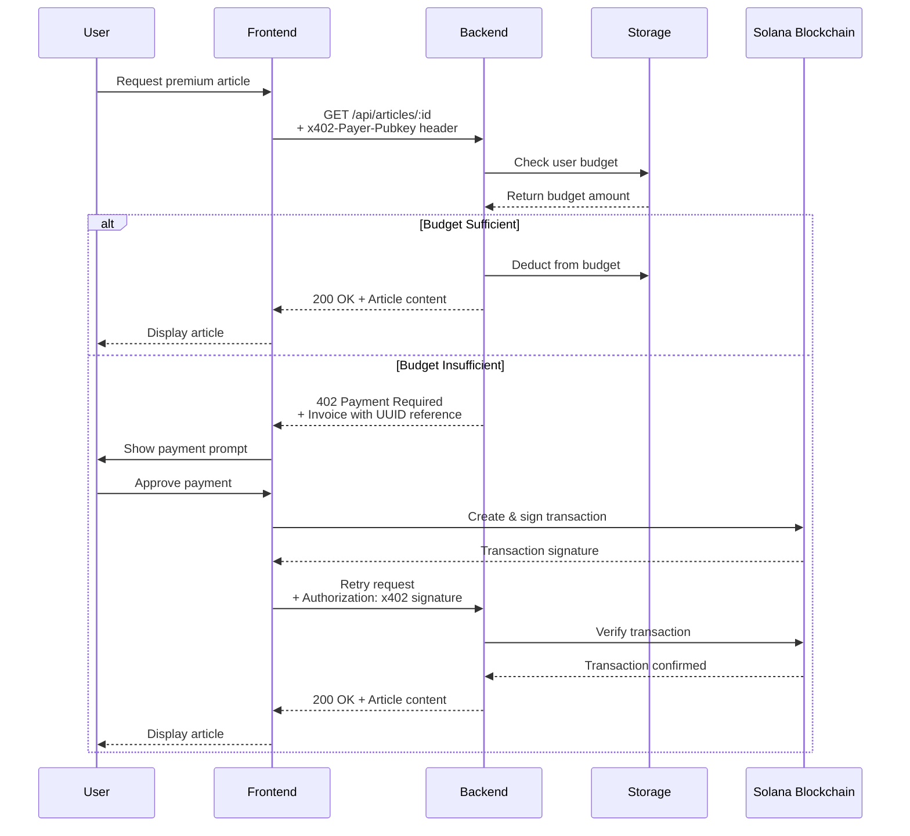
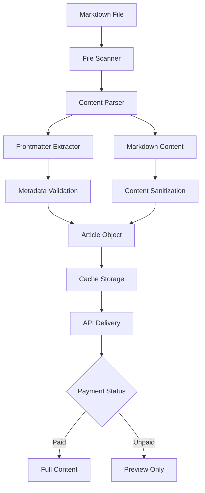

# Architecture Documentation

## System Overview

X402 Drift is a distributed content monetization platform that combines traditional web technologies with blockchain-based payments. The architecture is designed around the x402 HTTP payment protocol, enabling seamless micropayments for digital content.

## High-Level Architecture

```
┌─────────────────┐    HTTP/402     ┌─────────────────┐    Web3     ┌─────────────────┐
│   Frontend      │ ◄─────────────► │    Backend      │ ◄───────────► │   Solana        │
│   (React)       │                 │   (Express)     │              │   Blockchain    │
└─────────────────┘                 └─────────────────┘              └─────────────────┘
         │                                   │                                 │
         │                                   │                                 │
    ┌────▼────┐                         ┌────▼────┐                     ┌─────▼─────┐
    │ Storage │                         │ Storage │                     │  Wallets  │
    │ (State) │                         │ (SQLite│                     │ (Phantom, │
    └─────────┘                         │   KV)   │                     │ Solflare) │
                                       └─────────┘                     └───────────┘
```

## Component Architecture

### Frontend Architecture

The frontend follows a modular React architecture with clear separation of concerns:

```
src/
├── App.jsx                    # Root application component
├── x402.jsx                   # x402 payment provider
├── useX402.js                 # Custom hook for x402 functionality
├── Articles.jsx               # Article management component
├── AgentComponent.jsx         # AI assistant component
└── index.jsx                  # Application entry point
```

#### Key Frontend Components

**App.jsx** (`frontend/src/App.jsx:50-87`)
- Provides wallet connection context using Solana wallet adapters
- Wraps the entire application in necessary providers (Connection, Wallet, X402)
- Implements error boundaries for graceful error handling
- Configures the Solana network (devnet/mainnet)

**X402Provider** (`frontend/src/x402.jsx:18-202`)
- Core payment logic for the x402 protocol
- Handles Solana transaction creation and signing
- Manages budget deposits and automatic retries
- Provides `fetchWith402` function for seamless payment integration

**Articles Component** (`frontend/src/Articles.jsx:6-292`)
- Manages article fetching, display, and user interactions
- Handles premium vs. free article differentiation
- Implements modal-based article reading experience
- Integrates with x402 payment system for premium content

**Agent Component** (`frontend/src/AgentComponent.jsx:4-235`)
- AI-powered assistant for content discovery
- Integrates with backend tools for article search and retrieval
- Handles budget management and top-up functionality
- Provides conversational interface for user guidance

### Backend Architecture

The backend follows a layered architecture with clear separation of concerns:

```
backend/
├── app.ts                     # Express application and routes
├── paywall.ts                 # x402 payment middleware
├── article-service.ts         # Article management service
├── storage.ts                 # Data storage abstraction
├── types.ts                   # TypeScript definitions
├── pricing.ts                 # Payment configuration
├── validation.ts              # Input validation utilities
├── error-handler.ts           # Centralized error handling
├── rate-limiter.ts            # API rate limiting
├── logger.ts                  # Structured logging
├── config.ts                  # Configuration management
└── articles/                  # Markdown article files
```

#### Core Backend Components

**Express Application** (`backend/app.ts:42-278`)
- Main application entry point with API route definitions
- Middleware configuration (CORS, rate limiting, error handling)
- Payment flow orchestration with budget and x402 paywalls
- Article service integration and agent tool definitions

**Payment Middleware** (`backend/paywall.ts:193-363`)
- `budgetPaywall`: Checks user's pre-paid budget before processing
- `x402Paywall`: Handles HTTP 402 payment required responses
- `verifyTransaction`: Validates Solana transactions on-chain
- `requirePayment`: Ensures payment was successfully processed

**Article Service** (`backend/article-service.ts:47-278`)
- Markdown file processing with frontmatter parsing
- Content caching with TTL-based invalidation
- Security-focused content sanitization
- Preview and full content separation

## Data Flow Architecture

### Payment Flow

The payment system implements a sophisticated two-tier payment approach:

1. **Budget Check**: First attempts to use pre-paid budget
2. **x402 Payment**: Falls back to on-demand payment if budget insufficient



### Content Management Flow

Article content follows a sophisticated processing pipeline:

1. **File Discovery**: Scan articles directory for markdown files
2. **Content Parsing**: Extract frontmatter and markdown content
3. **Security Validation**: Sanitize and validate all content
4. **Caching**: Store processed articles with TTL-based invalidation
5. **Delivery**: Serve appropriate content based on payment status



## Security Architecture

### Multi-Layer Security

1. **Input Validation Layer** (`backend/validation.ts`)
   - Solana address validation
   - Transaction signature verification
   - File path sanitization
   - Markdown content filtering

2. **Rate Limiting Layer** (`backend/rate-limiter.ts`)
   - General API rate limiting
   - Payment-specific rate limiting
   - Budget operation limits
   - Article access throttling

3. **Transaction Security Layer** (`backend/paywall.ts`)
   - On-chain transaction verification
   - Reference-based replay protection
   - Amount validation with decimal precision
   - Wallet address verification

4. **Content Security Layer** (`backend/article-service.ts`)
   - File system traversal protection
   - Content sanitization
   - Markdown injection prevention
   - Cache isolation

### Error Handling Architecture

The application implements comprehensive error handling:

**Frontend Error Boundaries** (`frontend/src/App.jsx:12-48`)
- Catches wallet initialization errors
- Provides graceful fallback UI
- Enables recovery through page refresh

**Backend Error Handler** (`backend/error-handler.ts`)
- Centralized error processing
- Structured error logging
- Client-safe error responses
- Error context preservation

## Performance Architecture

### Frontend Optimization

1. **Code Splitting**: Dynamic imports for route-based code splitting
2. **Component Caching**: React.memo for expensive component renders
3. **State Management**: Efficient state updates with minimal re-renders
4. **Asset Optimization**: Vite-based build optimization

### Backend Optimization

1. **Content Caching**: TTL-based article caching
2. **Parallel Processing**: Concurrent article file processing
3. **Database Optimization**: Efficient storage patterns
4. **Response Streaming**: Efficient content delivery

## Scalability Architecture

### Horizontal Scaling

- **Frontend**: Stateless architecture enables CDN distribution
- **Backend**: External storage (SQLite + optional Vercel KV)
- **Blockchain**: Solana's high throughput handles transaction volume

### Vertical Scaling

- **Caching**: Multi-level caching reduces database load
- **Rate Limiting**: Prevents system overload
- **Async Processing**: Non-blocking I/O throughout

## Integration Architecture

### Blockchain Integration

The system integrates deeply with Solana blockchain:

1. **Transaction Processing** (`backend/paywall.ts:60-188`)
   - SPL token transfers
   - Memo instruction for reference tracking
   - Account creation automation
   - Block height confirmation

2. **Wallet Integration** (`frontend/src/x402.jsx:22-96`)
   - Multi-wallet support (Phantom, Solflare, etc.)
   - Transaction signing workflow
   - Connection management
   - Error handling

### Storage Integration

Multiple storage backends supported:

1. **SQLite** (`backend/storage.ts`)
   - Local development database
   - User budget tracking
   - Transaction reference storage

2. **Vercel KV** (Optional)
   - Production-grade key-value store
   - Global distribution
   - Automatic failover

## Deployment Architecture

### Frontend Deployment

- **Platform**: Vercel (recommended)
- **Build Process**: Vite production build
- **CDN**: Global edge distribution
- **Environment**: Static site generation

### Backend Deployment

- **Platform**: Any Node.js hosting
- **Runtime**: TypeScript compilation
- **Process**: PM2 process management
- **Monitoring**: Structured logging integration

## Monitoring and Observability

### Logging Architecture

**Structured Logging** (`backend/logger.ts`)
- Separate loggers for different components
- JSON-formatted logs for parsing
- Contextual information inclusion
- Environment-specific log levels

### Metrics and Monitoring

1. **API Performance**: Request timing and success rates
2. **Payment Analytics**: Transaction success and failure tracking
3. **User Behavior**: Article access patterns
4. **System Health**: Resource utilization and error rates

This architecture provides a robust, scalable, and secure foundation for blockchain-powered content monetization while maintaining excellent user experience and developer productivity.